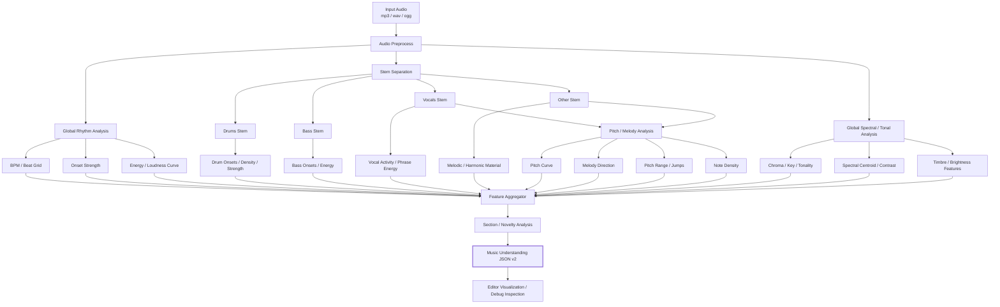

# BeatBound — Audio Understanding V2 Development Prompt

## 0. 本轮目标

本轮只升级 BeatBound Editor 的**音乐理解层（Audio Understanding / Analysis Layer）**。

当前 editor 已经能够对音乐进行 analyze，但现有分析结果过于偏重 BPM / beat timing，导致后续只能进行简单的节拍映射。

本轮需要把 analyzer 从：

```text
Audio
  ↓
BPM / Beat
  ↓
简单分析结果
```

升级为：

```text
Audio
  ↓
基础音频预处理
  ↓
节拍 / onset / energy 分析
  ↓
Stem Separation（鼓 / 贝斯 / 人声 / 其他）
  ↓
旋律 / pitch / note event 分析
  ↓
音色 / 调性 / 高层音乐特征分析
  ↓
段落 / 能量 / 音乐事件聚合
  ↓
统一的 Music Understanding JSON
```

**重要：本轮到这里为止。**

禁止实现：

```text
Music Understanding JSON
  ↓
AI Director
  ↓
Game Mode
  ↓
Pattern
  ↓
Level
```

因为 BeatBound 的 gamemode / mechanics / patterns 目前仍在重构，本轮必须保证音乐分析层与未来关卡生成系统完全解耦。

---

## 0.1 并行开发 / 工作区隔离（最高优先级）

**当前 Arena 与 Runner gamemode 正在由其他并行任务同时重构。** 本任务必须把“避免工作文件冲突”视为最高优先级约束之一。

开始任何修改前，必须先检查当前 worktree：

```bash
git status --short
git diff --name-only
```

然后建立本任务自己的**修改白名单（allowlist）**。原则上只允许修改：

```text
editor/ 下与 audio / analyze / schema / cache / analysis debug UI 直接相关的文件
editor 自己的 Python 依赖文件（如果项目已有独立依赖文件）
与 Audio Understanding V2 直接相关的 editor 文档 / 测试
```

以下区域视为**并行任务保护区**，除非它们本来就在 `editor/` 内且确实是分析层专用代码，否则不得修改：

```text
ARENA runtime / mechanics / patterns
RUNNER runtime / mechanics / patterns
VERTICAL runtime / mechanics / patterns
RADIAL runtime / mechanics / patterns
共享 gameplay runtime
玩家移动 / 碰撞 / hazard / projectile / level runtime
游戏模式切换逻辑
当前正在被 Arena / Runner 重构使用的配置与资源
```

### 严格禁止的 Git / 文件操作

不得为了“让工作区干净”或解决冲突而执行：

```bash
git reset --hard
git checkout -- .
git restore .
git clean -fd
git stash
```

也不要自动：

```text
rebase
merge
commit
push
大范围 prettier / formatter
全项目自动修复
全项目 import sorting
```

**绝对不要覆盖、回滚、暂存或整理其他并行任务留下的修改。**

如果发现目标文件已经存在未提交修改：

1. 先判断这些修改是否属于本 Audio Understanding 任务。
2. 如果明显属于 Arena / Runner 或其他并行任务，不要碰该文件。
3. 优先通过新建 Audio-specific module / adapter / compatibility layer 来绕开共享文件。
4. 如果一个共享文件确实必须修改，只做最小、局部、可合并的改动，并在最终报告中明确列出原因与具体行级影响。
5. 不要为了本任务顺手修复任何无关问题。

### 依赖安装隔离

新增 Python 依赖时，优先使用 Editor 自己的依赖边界。不要因为安装 Demucs / Basic Pitch / Essentia 去改动游戏 runtime 的依赖配置。

如果项目当前只有共享依赖文件，先审查是否能新增：

```text
editor/requirements-audio.txt
editor/requirements.txt
或现有 editor 专用依赖入口
```

不要自行重构整个依赖体系。

### 每个开发阶段都要做冲突检查

在 Audit 后、主要实现完成后、最终测试前分别执行一次：

```bash
git status --short
git diff --name-only
```

确保本任务没有意外修改 Arena / Runner 相关文件。

最终报告必须增加：

```text
Parallel-work Safety Check
- Pre-existing modified files observed
- Files intentionally modified by this task
- Protected Arena/Runner files touched: NONE（正常情况）
- Shared files touched, if any, and why
```


# 1. 修改后的技术流程图

## 1.1 总体流程



---

## 1.2 本轮系统边界

本轮开发的终点必须是：

```text
song.mp3
    ↓
Audio Analyzer V2
    ↓
music_analysis_v2.json
```

未来才会继续：

```text
music_analysis_v2.json
    ↓
Director / Composer / Gameplay Grammar
    ↓
level.json
```

**本轮禁止提前实现第二段。**

---

# 2. 推荐技术栈

本轮优先使用**本地、免费、开源、可重复执行**的音频分析工具。

建议组合：

### A. librosa

继续保留现有 librosa，用于：

- tempo / BPM
- beat tracking
- onset detection
- RMS energy
- chroma
- spectral centroid
- spectral contrast
- tempogram
- basic segmentation support

librosa 负责轻量、稳定、快速的基础 DSP 特征。

---

### B. Stem Separation

增加音乐源分离能力。

目标至少得到：

```text
drums
bass
vocals
other
```

优先采用成熟的 Demucs / HTDemucs 兼容实现。

要求：

- 必须封装为独立 adapter
- 不允许 analyzer 主逻辑直接依赖某个具体 Demucs CLI
- 后续可以更换 separation backend
- 若模型不可用，系统必须 graceful fallback，而不是让整个 analyze 崩溃

接口建议：

```python
separate_audio(input_path) -> {
    "drums": path | None,
    "bass": path | None,
    "vocals": path | None,
    "other": path | None
}
```

---

### C. Melody / Pitch Analysis

增加旋律 / pitch 层。

推荐优先集成 Basic Pitch 或兼容的 pitch / note transcription backend。

不要把 MIDI 转写准确率当作本项目核心目标。

BeatBound 真正需要的是：

```text
什么时候有旋律事件
音高大概是多少
旋律是上升还是下降
有没有明显的大跳
旋律密度如何
音域如何变化
```

因此可以将 note-level 结果进一步压缩成 gameplay-agnostic musical descriptors。

---

### D. Essentia（推荐，但做成可选模块）

如果当前 Python 环境安装稳定，可以加入 Essentia，用于增强：

- tonal features
- key / scale estimation
- spectral descriptors
- rhythm descriptors
- high-level music descriptors

但不要让整个 Editor 强依赖 Essentia 才能工作。

设计成：

```text
core analyzer
+
optional enhanced analyzer
```

缺少 Essentia 时仍然必须能够输出完整结构的 JSON，只是部分字段为 null / unavailable。

---

# 3. 核心架构要求

不要继续把所有分析代码写进一个大脚本。

建议拆成：

```text
editor/
  audio/
    preprocess.py
    rhythm_analyzer.py
    energy_analyzer.py
    stem_separator.py
    stem_features.py
    melody_analyzer.py
    tonal_analyzer.py
    structure_analyzer.py
    feature_aggregator.py
    schema.py
```

实际目录应根据当前项目结构适配，不要为了匹配此示例而强制重构无关文件。

核心原则：

```text
每一个 analyzer 只负责一种音乐信息
                    ↓
             Feature Aggregator
                    ↓
         Music Analysis JSON v2
```

---

# 4. 必须输出的 Music Understanding 数据

最终输出文件建议命名：

```text
music_analysis_v2.json
```

或者保持项目原有命名规则，但必须有明确 schema version。

最低结构：

```json
{
  "schemaVersion": 2,
  "source": {
    "file": "song.mp3",
    "durationSec": 182.42,
    "sampleRate": 44100
  },
  "global": {},
  "timeline": {},
  "sections": [],
  "events": [],
  "analysisMeta": {}
}
```

---

# 5. Global Features

至少包含：

```json
{
  "global": {
    "bpm": 128.4,
    "tempoConfidence": 0.86,
    "key": "F#",
    "scale": "minor",
    "overallEnergy": 0.72,
    "dynamicRange": 0.48,
    "brightness": 0.61,
    "rhythmicDensity": 0.74,
    "melodicDensity": 0.53
  }
}
```

如果某项无法可靠估计：

```json
"key": null
```

不要伪造结果。

---

# 6. Beat Grid

必须保留精确 beat timeline。

示例：

```json
{
  "timeline": {
    "beats": [
      {
        "index": 0,
        "time": 0.421,
        "strength": 0.72
      },
      {
        "index": 1,
        "time": 0.891,
        "strength": 0.81
      }
    ]
  }
}
```

如果可稳定得到 downbeat / bar：

```json
{
  "beat": 128,
  "bar": 32,
  "beatInBar": 1,
  "isDownbeat": true
}
```

如果无法稳定判断，不要硬编码 4/4。

---

# 7. Energy Timeline

能量不能只有一个全局值。

需要生成时间序列，例如：

```json
{
  "timeline": {
    "energy": [
      {
        "time": 0.0,
        "value": 0.12
      },
      {
        "time": 0.25,
        "value": 0.14
      }
    ]
  }
}
```

建议同时保留：

- raw / local RMS
- normalized energy
- smoothed energy

最终 JSON 可只公开 normalized / smoothed 数据，避免文件过大。

要求归一化到：

```text
0.0 - 1.0
```

---

# 8. Stem-level Features

Stem Separation 成功时至少分析：

```text
drums
bass
vocals
other
```

## drums

提取：

- onset timestamps
- onset strength
- drum activity
- local drum density
- local drum energy

不要求本轮精确分类所有 kick / snare / hi-hat。

如果现有方案能够可靠区分，可增加：

```text
kickLike
snareLike
highPercussionLike
```

但必须用 `Like` 或 confidence 表示其不确定性。

不要伪装成 100% 准确的鼓件识别。

---

## bass

提取：

- onset
- energy
- activity
- low-frequency intensity

---

## vocals

提取：

- vocal active / inactive
- vocal energy
- phrase-like region
- onset / entry
- silence gaps

本轮**不做歌词识别**。

---

## other

主要用于：

- melody candidate
- harmonic activity
- timbre movement

---

# 9. Melody / Pitch Representation

这一层非常重要。

不要只保存原始 pitch 数组。

需要同时生成低层和高层描述。

例如：

```json
{
  "melody": {
    "notes": [
      {
        "start": 12.42,
        "end": 12.71,
        "pitchMidi": 64,
        "confidence": 0.83
      }
    ],
    "phrases": [
      {
        "start": 12.0,
        "end": 15.5,
        "direction": "rising",
        "pitchRangeSemitones": 9,
        "noteDensity": 0.71,
        "largestJumpSemitones": 5
      }
    ]
  }
}
```

至少派生：

```text
pitch height
pitch direction
pitch range
pitch jump
note density
melodic activity
```

Direction 枚举建议：

```text
rising
falling
stable
mixed
unknown
```

---

# 10. Tonal / Timbre Features

至少包含部分：

```text
chroma
key / scale
spectral centroid
spectral contrast
brightness
low / mid / high frequency balance
```

这些信息主要服务未来：

```text
音乐氛围理解
视觉主题响应
AI Director
```

本轮**只分析，不使用它们驱动游戏**。

---

# 11. Section / Structure Detection

需要增加歌曲结构变化的检测能力，但不要过度承诺自动识别：

```text
intro
verse
chorus
drop
bridge
outro
```

优先做：

```text
结构边界检测
section similarity
section energy profile
section feature summary
```

输出可以是：

```json
{
  "sections": [
    {
      "id": "section_00",
      "start": 0.0,
      "end": 15.8,
      "label": null,
      "energy": 0.22,
      "drumActivity": 0.18,
      "bassActivity": 0.20,
      "vocalActivity": 0.02,
      "melodicActivity": 0.31
    }
  ]
}
```

如果无法可靠判断“这是 chorus”，就不要写：

```json
"label": "chorus"
```

宁可：

```json
"label": null
```

或者：

```json
"label": "high_energy_section"
```

仅当算法依据足够明确时才输出语义标签。

---

# 12. Musical Event Layer

增加一个统一事件层。

这是未来 AI Director 最重要的输入之一，但本轮**只生产数据，不消费数据**。

示例：

```json
{
  "events": [
    {
      "time": 42.13,
      "type": "strong_onset",
      "strength": 0.91,
      "source": "drums"
    },
    {
      "time": 43.02,
      "type": "melody_rise",
      "strength": 0.72,
      "source": "melody"
    },
    {
      "time": 45.40,
      "type": "energy_peak",
      "strength": 0.94,
      "source": "global"
    },
    {
      "time": 48.00,
      "type": "section_boundary",
      "strength": 0.88,
      "source": "structure"
    }
  ]
}
```

推荐事件类型：

```text
beat
strong_beat
strong_onset
energy_rise
energy_drop
energy_peak
melody_rise
melody_fall
melody_peak
large_pitch_jump
vocal_entry
vocal_exit
bass_entry
drum_density_rise
section_boundary
```

不要加入任何 gameplay event，例如：

```text
spawn_ring
jump
bullet_burst
change_mode
```

这些属于下一阶段。

---

# 13. Feature Window

除了 beat-level 数据，需要增加固定窗口聚合。

建议：

```text
250 ms / 500 ms
```

或根据当前性能选择一个合理值。

窗口数据示例：

```json
{
  "time": 32.5,
  "energy": 0.81,
  "drumActivity": 0.92,
  "bassActivity": 0.74,
  "vocalActivity": 0.10,
  "melodicActivity": 0.66,
  "pitchNormalized": 0.71,
  "brightness": 0.52
}
```

未来 Director 可以直接消费这种统一 timeline，而不用重新处理 raw audio。

---

# 14. Normalization

不同歌曲的绝对响度 / 音域 / 密度差异很大。

所以对适合做相对比较的字段统一归一化：

```text
0.0 → 1.0
```

例如：

```text
energy
activity
onset strength
density
brightness
pitch normalized
```

同时保留必要原始值：

```text
pitchMidi
Hz
BPM
seconds
```

原则：

```text
raw value = 音乐学 / debug
normalized value = 后续系统消费
```

---

# 15. Confidence / Availability

不要把音频 ML 结果当作绝对真值。

可以增加：

```json
{
  "analysisMeta": {
    "stemSeparation": {
      "available": true,
      "backend": "..."
    },
    "melody": {
      "available": true,
      "backend": "...",
      "confidence": 0.74
    }
  }
}
```

任何可选组件失败时：

```text
warn
↓
fallback
↓
继续生成 JSON
```

不能因为：

```text
Basic Pitch missing
Essentia missing
Stem model missing
```

导致整个 editor 无法 analyze。

---

# 16. Caching

Stem Separation / ML inference 可能很慢。

必须支持缓存。

缓存 key 至少考虑：

```text
audio hash
analyzer version
model version
analysis settings
```

例如：

```text
editor/cache/audio/<hash>/
```

缓存：

```text
stems
pitch results
intermediate features
final analysis JSON
```

重复 analyze 同一首歌时，不应重新进行所有高成本推理。

---

# 17. CLI / Editor Workflow

保持当前 Editor 工作流尽量不变。

例如现有：

```bash
npm run editor:analyze -- song.mp3
```

或：

```bash
python analyze.py song.mp3
```

优先保持兼容。

允许增加：

```bash
--fast
--full
--no-stems
--force
```

推荐：

### fast

```text
librosa-only / cheap analysis
```

### full

```text
stem + melody + enhanced features
```

默认模式根据当前 Editor 使用体验决定，但必须在 README 说明。

---

# 18. Editor UI

本轮 UI 只需要增加分析检查能力。

不要重新设计整个编辑器。

如果当前 Editor 已有 timeline，增加可切换查看：

```text
Beat
Energy
Drums
Bass
Vocals
Melody / Pitch
Sections
```

最简单可以是 debug overlay。

目标是开发者能够肉眼确认：

```text
音乐高潮
鼓点
人声进入
旋律上升
结构边界
```

是否大致与真实歌曲对齐。

本轮不需要做专业 DAW UI。

---

# 19. 性能要求

不要为了分析质量把 workflow 做到不可用。

需要记录：

```text
analyze total time
stem separation time
melody analysis time
feature aggregation time
```

写入 log 或 metadata。

对 3~5 分钟歌曲：

目标不是实时分析，而是：

```text
一次分析
↓
缓存
↓
后续快速编辑
```

---

# 20. 测试要求

至少增加以下测试。

## Schema Test

确认输出：

```text
schemaVersion
source
global
timeline
sections
events
analysisMeta
```

存在且类型正确。

---

## Determinism Test

同一音频、同一 analyzer 版本、同一设置：

核心输出应保持稳定。

允许 ML backend 存在极小浮点误差。

---

## Fallback Test

模拟：

```text
stem backend unavailable
melody backend unavailable
Essentia unavailable
```

确认 analyze 仍能完成。

---

## Short Audio Test

例如：

```text
5s
10s
```

不能崩溃。

---

## Silence Test

输入接近静音音频时：

```text
BPM 可以 null
energy 很低
sections 合理
```

不能生成大量虚假事件。

---

# 21. Debug / Report

Analyze 完成后打印简洁报告：

```text
BeatBound Audio Analysis V2
---------------------------
Duration: 183.4s
BPM: 128.2
Beats: 392
Sections: 8

Stem Separation: OK
Drums activity: 0.74
Bass activity: 0.63
Vocals activity: 0.48

Melody Analysis: OK
Melody events: 841
Pitch range: 24 semitones

Events:
Strong onset: 132
Energy peaks: 18
Section boundaries: 7

Output:
music_analysis_v2.json
```

---

# 22. 本轮明确禁止事项

以下内容不要做：

### 禁止 1

不要根据音乐分析结果生成任何 game mode。

### 禁止 2

不要生成 obstacle / note / projectile / chain / ring。

### 禁止 3

不要修改 ARENA / RUNNER / VERTICAL / RADIAL 的规则。

### 禁止 4

不要设计 MusicGameplayGrammar。

### 禁止 5

不要实现 AI Director。

### 禁止 6

不要让 LLM API 参与音频分析。

### 禁止 7

不要把现有 editor 大规模重写。

### 禁止 8

不要破坏当前 playtest / compile / level loader 工作流。

### 禁止 9

不要修改当前正在并行重构的 Arena / Runner gameplay 文件，即使看到明显 bug、格式问题、类型问题或“顺手可以修”的问题，也全部忽略。

### 禁止 10

不要通过 `git restore` / `checkout` / `reset` / `clean` / `stash` 等方式处理其他任务的未提交修改。

### 禁止 11

不要运行会改写整个仓库的 formatter / linter autofix / import sorter。若必须格式化，只格式化本任务新建或明确修改的 Audio Understanding 文件。

---

# 23. 向后兼容

当前 Editor 已经存在旧 analyze 输出和 blueprint / compiler workflow。

本轮需要：

1. 先完整审查当前 Editor analyze pipeline。
2. 明确旧 schema 被哪些文件读取。
3. 尽可能保留旧字段。
4. 如果必须修改 schema：
   - 增加 schemaVersion
   - 提供 adapter / compatibility layer
   - 不要直接导致现有 Editor 无法启动
5. 不要修改游戏 runtime 来适配本轮音乐分析。

即：

```text
new analyzer
↓
兼容旧 editor
```

而不是：

```text
new analyzer
↓
顺手重构整个项目
```

---

# 24. 实施顺序

严格按以下顺序开发。

## Step 1 — Audit

先阅读：

```text
editor/
analyze scripts
package.json
Python dependencies
analysis JSON schema
blueprint generator
editor UI
```

输出一份简洁审查结果：

```text
Current Pipeline
Files Involved
Current Schema
Compatibility Risks
Pre-existing Worktree Changes
Protected Arena / Runner Files
Audio-task Modification Allowlist
Planned Changes
```

在真正写代码前，明确声明本任务计划修改的文件范围。后续若需要超出 allowlist，必须先在自己的工作记录中说明原因，并优先寻找不修改共享 gameplay 文件的实现方式。

然后直接继续开发，不需要等待人工确认，除非遇到真正阻塞问题。

---

## Step 2 — Schema V2

先定义：

```text
music_analysis_v2
```

不要先写算法再临时拼 JSON。

---

## Step 3 — Core Features

先实现：

```text
BPM
beats
onsets
energy
chroma
spectral
```

---

## Step 4 — Stem Layer

实现：

```text
stem separation
stem cache
stem activity analysis
```

---

## Step 5 — Melody Layer

实现：

```text
pitch / note events
melody direction
pitch range
note density
```

---

## Step 6 — Structure

实现：

```text
section boundaries
section summaries
```

---

## Step 7 — Aggregation

统一生成：

```text
beats
windows
sections
events
global summary
```

---

## Step 8 — Visualization / Debug

在 Editor 里让这些数据至少可以被检查。

---

## Step 9 — Tests

执行已有 editor tests + 新增 analysis tests。

---

# 25. 最终交付要求

完成后必须给出报告，至少包含：

## A. 修改文件

```text
Added
Modified
Deleted
```

## B. 新 Audio Pipeline

说明：

```text
input
↓
processing
↓
output
```

## C. 实际启用的 backend

例如：

```text
librosa: yes
stem separator: yes
Basic Pitch: yes
Essentia: optional / unavailable
```

不要声称没有实际安装或执行成功的组件已经可用。

## D. JSON Example

贴一段真实 analyze 输出样例。

## E. Test Results

包括：

```text
unit tests
schema validation
fallback tests
existing editor checks
```

## F. Performance

至少使用一首实际歌曲报告：

```text
audio duration
analysis duration
cache hit duration
```

## G. Known Limitations

例如：

```text
polyphonic pitch accuracy
stem artifacts
section labels are heuristic
```

必须明确写出。

---

# 26. Definition of Done

只有满足下面条件才算完成：

- [ ] 不再只有 BPM / beat 信息
- [ ] 有连续 energy curve
- [ ] 有 onset 信息
- [ ] 有 drums / bass / vocals / other 的独立分析能力
- [ ] 有 melody / pitch 信息
- [ ] 有 melody direction / range / density
- [ ] 有 tonal / timbre 特征
- [ ] 有 section boundary
- [ ] 有统一 musical event layer
- [ ] 有 normalized timeline
- [ ] 有 schema version
- [ ] 有 cache
- [ ] 有 optional backend fallback
- [ ] 有测试
- [ ] Editor 可以查看 / debug 新分析结果
- [ ] 原有 Editor workflow 未被破坏
- [ ] 完全没有新增 gameplay generation
- [ ] 完全没有绑定 ARENA / RUNNER / VERTICAL / RADIAL
- [ ] 完全没有 AI Director / LLM level generation

---

# 27. 最重要的设计原则

本轮要建立的是：

```text
Music Understanding Layer
```

而不是：

```text
Level Generator V2
```

输出应该描述：

```text
音乐本身发生了什么
```

而不是描述：

```text
游戏应该发生什么
```

例如正确：

```text
energy rises
strong drum onset
melody rises
vocal enters
section boundary
```

错误：

```text
spawn bullets
switch to ARENA
make player jump
create ring
increase obstacle speed
```

确保这一层未来可以同时服务：

```text
AI Director
rule-based Director
manual Editor
music visualization
visual theme system
```

而无需重新分析音频。

---

# 28. Parallel Development Final Gate

在宣告完成前，必须额外完成以下 gate：

```text
[ ] 再次执行 git status --short
[ ] 再次执行 git diff --name-only
[ ] 确认没有意外修改 Arena 文件
[ ] 确认没有意外修改 Runner 文件
[ ] 确认没有回滚或覆盖其他人的未提交改动
[ ] 确认没有执行全仓库自动格式化
[ ] 确认 Audio Understanding 可以在不依赖 gamemode 重构完成的情况下独立工作
```

如果最终 diff 中出现 Arena / Runner 文件，默认视为异常。必须优先撤销**仅由本任务产生的那部分改动**；不得覆盖该文件中原本存在的其他未提交工作。若无法安全分离，则保留现状并在报告中明确标记冲突风险，不要擅自 reset / restore 整个文件。


# Final Instruction

现在先完整检查当前 BeatBound `editor/` 的实现，再按照上述约束对 Audio Analyzer 进行增量升级。

优先：

```text
稳定
可解释
模块化
缓存
向后兼容
```

不要追求一次加入所有最先进模型。

如果某个 ML backend 集成复杂或环境兼容性差，优先完成清晰的 adapter + fallback，并确保核心 V2 schema 和 pipeline 能稳定运行。

本次任务结束点严格为：

```text
Audio File
     ↓
Music Understanding V2
     ↓
music_analysis_v2.json
```

到此停止。
